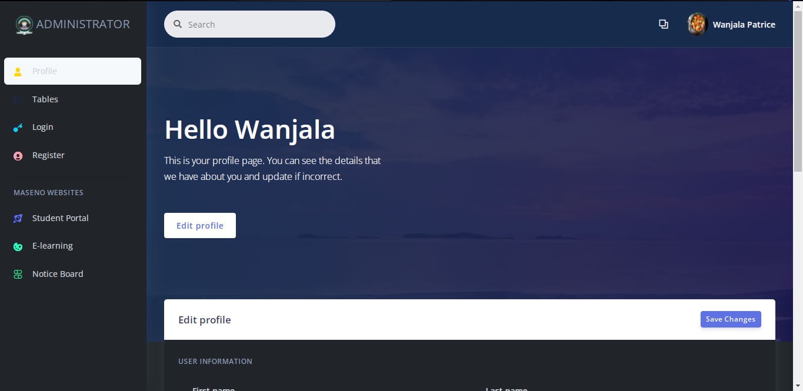

<h1> University enrollment system</h1>

A web application that facilitates the enrollement of new students to the university,
it allows the students to create an account then start  the enrollment process that is
closely monitored by the administrator who can edit, delete and download a pdf version
of the students who are at any stage of the enrollment.

## Student Portal

## Admin Portal

## Profile Page

- Where one can edit his/her profile

## How To conribute

<b>1.</b> Ensure you have <a href="https://www.apachefriends.org/index.html">XAMPP</a> or any other Web Server installed. 
<b>2.</b> Fork the repo then clone 
<b>3.</b> Change direcory to university_enrollment. 
<b>4.</b> Create a new branch. 
<b>5.</b> Make your changes, commit, push then create a pull request. 
